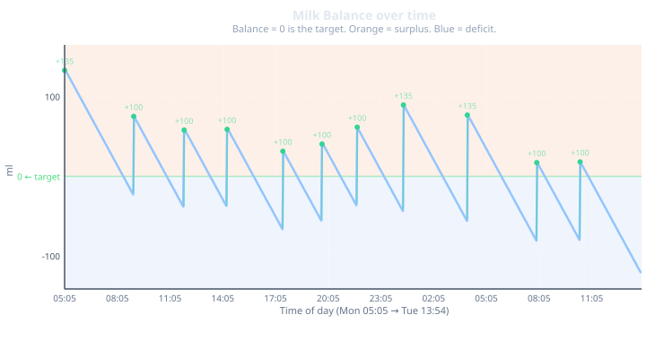
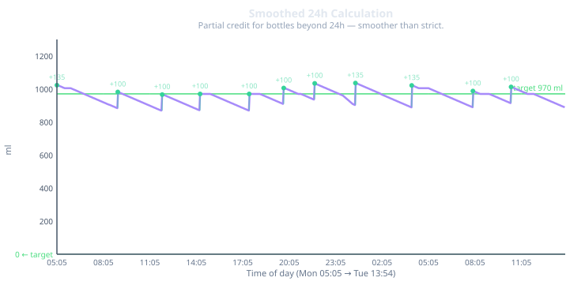

# Next Feeding Session Predictor — Design Document v2

**Status:** ~~Draft (2026-06-09, updated 2026-06-26)~~ **ARCHIVED 2026-07-25**  
**Author:** Kit + Koen

> ⚠️ **This document is archived.** The v2 predictor design (Predictors 1/2/3, single T\* binary search) has been superseded by the v3 architecture. See `next-session-predictor-design-v3.md` for the current design.

---

## Table of Contents

1. [Core Concepts](#1-core-concepts)
   - 1.1 [The Feeding Session](#11-the-feeding-session)

   - 1.2 [Water Bottles vs Milk Bottles](#12-water-bottles-vs-milk-bottles)

   - 1.3 [Physical Energy Model](#13-physical-energy-model)

2. [Next Feed Predictors](#2-next-feed-predictors)
   - 2.1 [Predictor 1a — Standard (Last Session)](#21-predictor-1a--standard-last-session)

   - 2.1b [Predictor 1b — Standard (Pipeline)](#21b-predictor-1b--standard-pipeline)

   - 2.2 [Predictor 2 — Adjusted (Formula S)](#22-predictor-2--adjusted-formula-s)

   - 2.3 [Limitation of Predictor 2](#23-limitation-of-predictor-2)

   - 2.4 [Predictor 3 — Target-Aware Adjusted (T*)](#24-predictor-3--target-aware-adjusted-t)

3. [The App](#3-the-app)
   - 3.1 [Logging a Feeding Session](#31-logging-a-feeding-session)

   - 3.2 [Display Principle](#32-display-principle)

   - 3.3 [Dashboard Layout](#33-dashboard-layout)

   - 3.4 [Settings](#34-settings)

   - 3.5 [Next Bottle Selector — UI for Predictor 3](#35-next-bottle-selector--ui-for-predictor-3)

   - 3.6 [Best Size Now — Inverse Predictor](#36-best-size-now--inverse-predictor)

---

# 1. Core Concepts

## 1.1 The Feeding Session

A feeding session always starts with a parent deciding to give a bottle to their baby.
The parent prepares a bottle by measuring out a quantity of water — say 120 ml — and
mixing in powdered formula. The result is approximately 135 ml of prepared milk.

The parent then gives the milk to the baby. In the ideal case the baby drinks the whole
bottle in one go. In practice, the baby may drink part of it, fall asleep, and take the
rest when they wake up 20–30 minutes later. The parent gives the bottle in **multiple
steps** over time.

Regardless of how many steps it takes, the total milk given in one sitting is considered
one feeding session. The session starts when the first step is given and ends when the
bottle is finished.

---

## 1.2 Water Bottles vs Milk Bottles

Formula is always prepared by mixing water with powder. The amount of water determines
the bottle size — a "90 ml bottle" means 90 ml of water was measured out. After adding
the powder, the result is more milk than water.

**Preparation table:**

| Water ml | Prepared milk ml |
|----------|-----------------|
| 30 | 35 |
| 60 | 70 |
| 90 | 100 |
| 120 | 135 |
| 150 | 170 |
| 180 | 200 |
| 210 | 240 |

When describing or logging a bottle, water ml is the natural unit — parents measure
water, not milk. But when calculating how much energy the baby received, prepared milk
ml is the relevant quantity: the powder adds substance that contributes to nutrition.

All energy calculations in this document use **prepared milk ml**.

---

## 1.3 Physical Energy Model

### Energy as milk

We treat prepared milk as a direct proxy for energy: each ml of milk provides a unit
of energy. The daily energy requirement is expressed as a volume of milk, not calories,
because that is what parents measure and log.

**Daily target:**
Paediatric guidelines advise approximately 150 ml of prepared formula per kilogram of
body weight per day. This is the basis of the daily energy target:

```
dailyTargetMl = weightKg × 150
```

This guideline is supported by organisations including:

- Kind en Gezin (Belgium): kindengezin.be/nl/thema/voeding/flesvoeding

- Gezondheid.be (Belgium): 150–180 ml/kg/day

- Voedingscentrum (Netherlands): voedingscentrum.nl

- JGZ Richtlijnen (Netherlands): jgzrichtlijnen.nl

- NHS (UK): 150–200 ml/kg/day

- AAP / CDC (USA): ~165 ml/kg/day

- WHO / ESPGHAN (international)

- Better Health Channel (Australia)

### Energy consumption rate

The baby consumes energy continuously. We model this as a constant rate equal to
the daily target divided by 24 hours:

```
hourlyRate = dailyTargetMl / 24   (ml per hour)
```

For a 6.47 kg baby: `hourlyRate = 970.5 / 24 = 40.44 ml/h`


### Milk Balance

We give milk to the baby in order to supply energy to the baby. The baby converts this milk into energy that it uses to grow and survive.

This can be visualized as a milk balance function which tracks the amount of milk in the baby that is being converted to energy.

It starts at zero and fluctuates:

- Each bottle adds its milk value to the balance (a positive spike)
- The balance decays continuously at `hourlyRate` as the baby converts that milk into energy

```
balance(T) = Σ milkMl_i − hourlyRate × (T − feed_i.timestamp)
             for all feeds given before T
```

The objective is to not let this function go below zero because that would mean that the baby draws its energy from other resources than milk. So the target is always zero: a balance of zero means the baby is exactly meeting its energy needs.

### Milk Balance over time — illustration

The following example will be used throughout this document. It represents a realistic
sequence of 26 feeding sessions for a 6.47 kg baby over two days. The first 15 feeds
(Saturday–Monday morning) form the history that ensures the 24h window is fully populated
from feed 16 onwards. All graphs in this document start at feed 16 (Mon 05:05).

**Full feed table (26 sessions):**

| # | Day | Time | Water ml | Milk ml |
|---|-----|------|----------|---------|
| 1 | Sat | 10:55 | 90 | 100 |
| 2 | Sat | 14:01 | 120 | 135 |
| 3 | Sat | 16:39 | 90 | 100 |
| 4 | Sat | 19:04 | 90 | 100 |
| 5 | Sat | 22:02 | 90 | 100 |
| 6 | Sun | 00:40 | 120 | 135 |
| 7 | Sun | 03:06 | 90 | 100 |
| 8 | Sun | 05:58 | 90 | 100 |
| 9 | Sun | 08:28 | 120 | 135 |
| 10 | Sun | 11:50 | 90 | 100 |
| 11 | Sun | 14:59 | 90 | 100 |
| 12 | Sun | 18:12 | 90 | 100 |
| 13 | Sun | 20:50 | 120 | 135 |
| 14 | Sun | 23:33 | 90 | 100 |
| 15 | Mon | 01:58 | 90 | 100 |
| **16** | **Mon** | **05:05** | **120** | **135** |
| 17 | Mon | 09:01 | 90 | 100 |
| 18 | Mon | 11:53 | 90 | 100 |
| 19 | Mon | 14:20 | 90 | 100 |
| 20 | Mon | 17:30 | 90 | 100 |
| 21 | Mon | 19:44 | 90 | 100 |
| 22 | Mon | 21:44 | 90 | 100 |
| 23 | Tue | 00:22 | 120 | 135 |
| 24 | Tue | 04:00 | 120 | 135 |
| 25 | Tue | 07:57 | 90 | 100 |
| 26 | Tue | 10:25 | 90 | 100 |

*6.47 kg × 150 ml/kg/day = 970.5 ml/day — hourlyRate = 40.44 ml/h*

The graph below shows the milk balance from feed 16 (Mon 05:05) to Tue 13:54.
Orange = surplus (balance above zero); blue = deficit (balance below zero).



### Tracking Milk Given

In order to comply with the 150 ml per kg weight per 24h guideline of health organizations, we need to track the amount of milk that is given to a baby over the last 24 hours. We want to do this at each moment in time.

A naïve approach sums only the milk content of bottles given in the last 24 hours. This produces a value that fluctuates heavily, dropping sharply whenever a bottle crosses the 24h boundary and exits the window.

To avoid this, we add the partial energetic credit of bottles that are just outside the 24h window. A bottle that is 25 hours old has not had all of its energy absorbed — there is still a small residual contribution. We credit that residual:

```
bottleCredit(age, milkMl) =
    milkMl                                    if age ≤ 24h
    max(0, milkMl − hourlyRate × (age − 24))  if age > 24h

intake(T) = Σ bottleCredit(age_i, milkMl_i) for all feeds before T
```

This is the **24h intake** at time T — the single status calculation used throughout the app. The curve is stable, as bottles lose credit gradually rather than disappearing abruptly.




# 2. Next Feed Predictors

All three predictors answer the question: *when should the next bottle be given?*
They differ in what information they use and what they guarantee.

## 2.1 Predictor 1a — Standard (Last Session)

**Question:** When has the energy from the current session been fully consumed?

The standard time is purely physical: the total energy given in the last session divided
by the rate at which the baby consumes it, starting from the first step of the session.

```
standardNext = session.start + totalMilkMl / hourlyRate
```

**Properties:**

- Depends only on the last session, not on the baby's overall energy state

- A 90 ml session (100 ml milk) at 09:00 with hourlyRate = 40.44 ml/h:

  `standardNext = 09:00 + 100/40.44 h = 09:00 + 2h 28m = 11:28`

- A 120 ml session (135 ml milk) lasts 3h 20m

---

## 2.1b Predictor 1b — Standard (Pipeline)

**Question:** When has the cumulative energy from **all previous bottles** been fully
consumed — i.e. when does the milk balance reach zero?

This is an alternative formulation of the Standard predictor. Rather than looking only
at the last session, it considers the total accumulated energy pool across all historical
feeds and asks when that pool runs to zero.

From the milk balance definition in §1.3:

```
balance(T) = Σ [milkMl_i − hourlyRate × (T − t_i)]   for all feeds before T
```

Solving for `balance(T) = 0` with no new feeds added:

```
T_pipeline = Σ (t_i + milkMl_i / hourlyRate) / n
```

That is: the average of each bottle's individual "natural expiry" — the time at which
that bottle's energy alone would be fully consumed.

**Equivalence to the 150 ml/kg/24h guideline:**
If the baby has been fed exactly at the daily target over the observed history,
`balance(now)` is approximately zero, and `T_pipeline ≈ now`. The predictor drifts
forward when the baby has a net surplus and backward when in deficit — which is
the same signal the 150 ml/kg/24h rule tracks, just expressed as a time instead of
a volume percentage.

**Contrast with Predictor 1a:**
- 1a is local: only the most recent bottle determines the interval.
- 1b is global: every historical bottle contributes; a burst of large bottles pushes
  `T_pipeline` further out even if the last bottle was small.

**Edge cases:**
| Condition | Behaviour |
|-----------|----------|
| `balance(now) ≤ 0` (baby already in deficit) | `T_pipeline` is in the past → show "Now" |
| Very few feeds in history (< 3) | Behaviour degenerates toward 1a — small-sample effect |
| Long gap since last feed | Balance is deep negative → T_pipeline well in the past → "Now" |

**Status:** Proposed addition — not yet implemented. Evaluate whether to expose as a
third column on the dashboard or as a toggle replacing 1a.

---

## 2.2 Predictor 2 — Adjusted

In this prediction model, we are adjusting the Standard predictor to compensate for an overfeeding or underfeeding situation.

We do this by comparing the 24h intake to the target to calculate the surplus or deficit:

```
surplus = intake(T) − dailyTargetMl
```

- Surplus > 0: baby has received more energy than the daily target; next feed can wait
- Surplus = 0: baby is in equilibrium; feed at the standard interval
- Surplus < 0: baby has received less energy than needed; feed sooner

We then use the surplus or deficit to adjust the timing for the next feed.

The adjustment shifts the standard next feed time proportionally to the surplus:

```
rawCorrection      = (surplus / hourlyRate) × 3600000   // ms
standardIntervalMs = standardNext − session.start
maxCorrectionMs    = standardIntervalMs × (maxCorrectionPct / 100)

adjustedNext = standardNext + clamp(rawCorrection,
               −maxCorrectionMs, +maxCorrectionMs)
```

In this formula, we use the ±`maxCorrectionPct` cap parameter (default 25%) to prevent a large surplus or deficit from pushing the feed time to an extreme value. This will spread the correction across multiple feeding sessions.

### Adjusted Explainer Text

The `?` button on the Adjusted column links to a live explainer page. The explanation
text must be **parameterised** — it adapts to the actual surplus/deficit condition
rather than using a fixed phrase.

The classification uses the thresholds from §3.4 (`yellowThresholdPct`, `redThresholdPct`).
The surplus is expressed as a percentage of `dailyTargetMl`:

```
surplusPct = surplus / dailyTargetMl × 100
```

| Condition | `surplusPct` range | Explanation text |
|-----------|-------------------|------------------|
| Largely ahead | > +`redThresholdPct` | "Baby has received significantly more than the daily target — waiting longer gives her time to catch up." |
| Slightly ahead | +`yellowThresholdPct` to +`redThresholdPct` | "Baby is slightly ahead of the daily target — a small delay is applied." |
| On track | −`yellowThresholdPct` to +`yellowThresholdPct` | "Baby is right on track — no adjustment needed." |
| Slightly behind | −`redThresholdPct` to −`yellowThresholdPct` | "Baby is slightly behind the daily target — feeding a little sooner is recommended." |
| Largely behind | < −`redThresholdPct` | "Baby has received significantly less than the daily target — feeding sooner is recommended." |
| Cap applied (ahead) | — | Append: "The maximum delay cap has been applied — the full surplus will spread across future feeds." |
| Cap applied (behind) | — | Append: "The maximum advance cap has been applied — the full deficit will spread across future feeds." |

Always show the numeric detail below the text:

```
Intake: [intake(T)] ml / [dailyTargetMl] ml target ([surplusPct %] [ahead / behind])
Raw correction: [rawCorrection min] → applied: [clampedCorrection min]
```

---

## 2.3 Predictor 3 — Optimised

The Predictor 2 model is a good step towards correcting an overfeeding or underfeeding situation. But it is not optimal. Because it calculates the adjustment from the last feed, which by the time of the next feed will already be outdated. So it does not take into account the change in milk given by the time the next feed is due. In order to solve this, we implement a search function that searches for the time T* where:

```
intake(T*) + milkPerBottle = dailyTargetMl
```

That is: we wait until the existing energy pool has decayed to exactly `dailyTargetMl − milkPerBottle`, so that giving one standard bottle brings the total to exactly the target.

### Finding T*

T* is found by binary search over the interval from `lastFeed` to `lastFeed + maxCorrectionMs`:

```
targetBefore = dailyTargetMl − milkPerBottle
```

- If `intake(lastFeed) ≤ targetBefore`: T* = lastFeed — already at or below target, give now
- If `intake(T_max) > targetBefore`: T* = T_max — still surplus at cap boundary, cap applies
- Otherwise: binary search T* in [lastFeed, T_max] until `intake(T*) = targetBefore`

### Properties

- **Guaranteed zero surplus** after the next feed (unless the cap applies)
- **Accounts for all ongoing decay**: as T advances, any bottle crossing the 24h mark loses credit, driving intake down toward targetBefore

---

# 3. The App

## 3.1 Logging a Feeding Session

When a parent gives a bottle, they open the **Log Feed** panel. Two approaches were considered:

**Option A — Log individual steps:**
The parent logs each partial delivery with its own timestamp and milk amount.
This precisely captures when each part of the bottle was given.

```
standardNext = firstStep.timestamp + Σ (step.milkMl / hourlyRate)
```

**Option B — Log the total:**
Log one entry: the start time of the session and the total milk given.
The parent selects the bottle size (60/90/120 ml water) and the app pre-fills the
milk amount, editable if the baby didn't finish.

```
standardNext = logTimestamp + totalMilkMl / hourlyRate
```

Both options are mathematically equivalent: `Σ step.milkMl = totalMilkMl` and the
timestamps produce the same result when the start time is used as the anchor.

**Decision:** Option B (single log per session) is the selected implementation.
It is simpler and requires less input from the parent.

**Key instruction:** always log the **start time** of the session (when the first
step was given), not when the bottle was finished.

## 3.2 Display Principle

**The app always shows the energy state at the moment of the last feed.**

`intakeAt = lastFeed.timestamp`

This is by design. A parent may log feeds hours after they were given. The app must
show the correct status at the time of the feed — not at the current clock time.

What updates in real time: only the relative time labels ("in 2h 15m") — nothing else.
Status, bottle counts, and next feed times only change when a new feed is logged.

## 3.3 Dashboard Layout

The dashboard shows (top to bottom):

1. **Log Feed** button
2. **Daily Target card** (swipeable) — ml, bottle equivalent, interval
3. **Status card** (swipeable) — 24h intake, gauge view, mood
4. **Three-column row** — Last feed | Next (standard) | Adjusted (T*)
5. **Summary row** — total feeds, last 24h count, ml/hour

The Adjusted column has a `?` button linking to a live explainer page showing:
the current surplus/deficit, raw correction, cap status, and resulting adjusted time.

## 3.4 Settings

| Setting | Default | Description |
|---------|---------|-------------|
| `weightKg` | — | Baby weight in kg |
| `mlPerKgPerDay` | 150 | Daily target formula (ml per kg) |
| `displayBottleVolumeWater` | 90 | Bottle size (water ml) for dashboard card display |
| `yellowThresholdPct` | 5 | On-track zone: within ±5% of target |
| `redThresholdPct` | 10 | Seriously off: beyond ±10% |
| `timeFormat` | 24h | Time display format |
| `maxCorrectionPct` | 25 | Cap: max correction = ±25% of standard interval |
| `useTargetAwarePredictor` | true | true = Predictor 3 (T*), false = Predictor 2 (Formula S) |

---

## 3.5 Next Bottle Selector — UI for Predictor 3

Predictor 3 requires a `nextBottleWaterMl` parameter: the bottle size the parent intends
to give at the next feed. T* is sensitive to this — a larger bottle means you can wait
longer; a smaller bottle means you feed sooner.

This parameter:
- Is **only used in the T* binary search**; it has no effect on P1, P2, display counts, or the `displayBottleVolumeWater` setting
- Must be **persistent** across sessions (parents shouldn't re-enter it each time)
- Should be **contextually visible** near the T* result (so parents see the assumption)
- Should be **easy to change** (bottle sizes graduate upward as the baby grows)

**Default:** the bottle size of the last logged feed.

### UI mechanism options

**A — Settings field only**
Add `nextBottleWaterMl` alongside `displayBottleVolumeWater` in Settings.
- ✅ Zero complexity
- ❌ Completely disconnected from the prediction — parents won't understand the connection
- ❌ Not contextually accessible when looking at the T* time

**B — Inline segmented control on the dashboard**
A chip strip (60 / 90 / 120 / 150 ml) anchored to the T* column or below the
three-column row. Tapping a chip immediately recalculates T*.
- ✅ Zero extra taps, immediate feedback
- ✅ Makes the input/output relationship obvious
- ❌ Takes up screen space permanently
- ❌ Can look noisy if the parent rarely changes it

**C — Tap-to-edit on the T* value (progressive disclosure)**
The T* time is displayed normally. A subtle edit icon or underline signals it is
configurable. Tap → small bottom sheet with 3–4 bottle size options → pick → T*
recalculates and sheet closes.
- ✅ Clean dashboard, no extra chrome
- ✅ Natural: you are looking at the result and want to change the assumption
- ✅ The sheet can explain "Predictor 3 assumes you'll give a 90 ml bottle next"
- ❌ Slightly less discoverable on first use

**D — Persistent "next bottle" pill near the T* column**
A small labeled badge above or below the T* column — e.g. `⬡ 90 ml` — always
visible, tappable to cycle or open picker.
- ✅ Always visible, zero extra taps to change
- ✅ Makes the assumption explicit at a glance
- ✅ Works well with the swipeable card layout
- ❌ Adds a persistent element that needs good visual design to avoid clutter

**E — Next bottle field in the Log Feed panel**
When logging a feed, a secondary field appears: "What bottle will you give next?".
Sets `nextBottleWaterMl` for the next T* calculation.
- ✅ Fits naturally into the planning moment
- ✅ No extra UI surface on the dashboard
- ❌ Parents may not know the next bottle size at log time
- ❌ Changes to the plan after logging require a separate settings path

**F — Auto-infer from recent history (no UI)**
Default `nextBottleWaterMl` to the most common bottle size from the last 3–5 feeds.
- ✅ Zero friction
- ❌ No control; could silently produce wrong T* during a growth transition
- ❌ Invisible assumption, which is dangerous for a time-critical calculation

### Decision: C + D

Combine the pill (D) for at-a-glance awareness with the tap-to-edit sheet (C).
The pill sits near the T* column and shows the current assumption (e.g. `⬡ 90 ml`).
Tapping it opens a simple 4-option picker (60 / 90 / 120 / 150 ml) with a one-liner:
"Predictor 3 assumes you'll give this bottle at the next feed."
T* recalculates immediately on selection.

---

## 3.6 Best Size Now — Inverse Predictor

### The question

The parent wants to feed *right now* and asks: **what is the best bottle size to give?**

This is the exact inverse of Predictor 3. P3 solves for time given a bottle size.
This solves for bottle size given time = now.

### The math

At T = now, find the bottle size that brings the baby precisely to the daily target:

```
optimalMilkMl = dailyTargetMl − intake(T_now)
```

Then snap to the nearest standard bottle size from the preparation table:

| Water ml | Milk ml |
|----------|---------|
| 60 | 70 |
| 90 | 100 |
| 120 | 135 |
| 150 | 170 |

Rounding: choose the standard size whose milk ml is closest to `optimalMilkMl`.
If the result falls exactly between two sizes, round up (err on the side of nourishment).

**Note on the display principle:** This is the one place in the app that uses the
live clock (`T_now`) rather than the frozen `lastFeed.timestamp`. The display
principle remains intact for all status cards and predictors. The best-size
calculation is explicitly a real-time advisory triggered by the parent — it
answers a question about the current moment, not the state at the last feed.

### Edge cases

| Condition | Behaviour |
|-----------|----------|
| Baby is at or above target (`intake(T_now) ≥ dailyTargetMl`) | Do **not** suggest a bottle. Show: "Over target — wait until T*". Any bottle, even the smallest, adds milk on top of an existing surplus. |
| `optimalMilkMl` exceeds maximum standard bottle (170 ml = 150 ml water) | Cap at 150 ml water; add note: "Even a full 150 ml bottle won't fully cover the deficit" |
| Result falls below minimum (< 35 ml = 30 ml water) | Suggest 60 ml water (practical minimum); add note |

### UI mechanism options

**A — "Best size?" tappable element in the T* column**
A small secondary label or icon beneath the T* time: "Feed now → 90 ml?". Tap → sheet
shows the optimal size, the calculation rationale, and an option to open Log Feed
pre-filled with that size.
- ✅ Physically adjacent to the related predictor — obvious pairing
- ✅ Makes the inverse relationship explicit without extra navigation
- ✅ Tap-through to Log Feed maintains a smooth workflow
- ❌ Column already has the pill from §3.5 — needs careful layout to avoid crowding

**B — Dedicated "Suggest size" button on the dashboard**
A standalone button or card outside the predictor columns.
- ✅ Prominent and always findable
- ❌ Adds a fourth interactive element to an already information-dense layout
- ❌ Visually disconnected from P3 even though it is mathematically related

**C — Pre-filled suggestion in the Log Feed panel**
When the parent opens Log Feed, the bottle size selector is pre-populated with the
optimal size and a subtle "✓ recommended" label. The parent can override freely.
A small info icon opens a one-line explainer: "Based on current intake vs. daily target."
- ✅ Zero extra dashboard chrome
- ✅ Presented at exactly the right moment (parent has decided to feed)
- ✅ Respects parent autonomy — a suggestion, not a constraint
- ✅ The info icon provides just enough transparency without cluttering the log form
- ❌ Not visible to a parent who just wants to check without logging

**D — Contextual proactive card**
When the app detects it is near the T* time, a card appears: "Time to feed soon —
recommended: 90 ml".
- ✅ Proactive — no tap required
- ❌ Requires push notification infrastructure or active foreground polling
- ❌ Can feel intrusive; parents may be in the middle of something
- ❌ Depends on T*, which already assumes a bottle size — circular if the
  recommended size differs from the assumed size

**E — Toggle in the predictor row: "When?" / "What size?"**
The T* column shows either the predicted time (default) or the optimal bottle size
for feeding right now, toggled by a small switch.
- ✅ Elegant use of existing space
- ✅ Makes the mathematical duality visible
- ❌ A toggle in a data cell is a non-standard pattern; parents may not discover it
- ❌ Mixes two different semantic questions in one visual slot

### Decision: C (primary) + A (secondary)

**Primary path — Log Feed pre-fill (C):**
The Log Feed panel always shows the optimal bottle size as the default selection,
labeled "✓ recommended". An info icon expands to: "A [X] ml bottle now brings baby
closest to the daily target. Current intake: [Y] ml / [Z] ml target."
The parent can tap any other size to override.

This covers the most common case: the parent has decided to feed and wants guidance.

**Secondary path — dashboard hint (A):**
Below the T* time (and the next-bottle pill from §3.5), a small contextual line shows:
"Feed now → [X] ml". This is read-only, always current, and gives an at-a-glance
answer without opening Log Feed. Tapping it opens Log Feed pre-filled.

**Why not D (proactive card):** The circular dependency between the assumed next
bottle size and the recommended size makes D unreliable without extra logic. Defer
until notification infrastructure is in place and the edge case is resolved.

---

