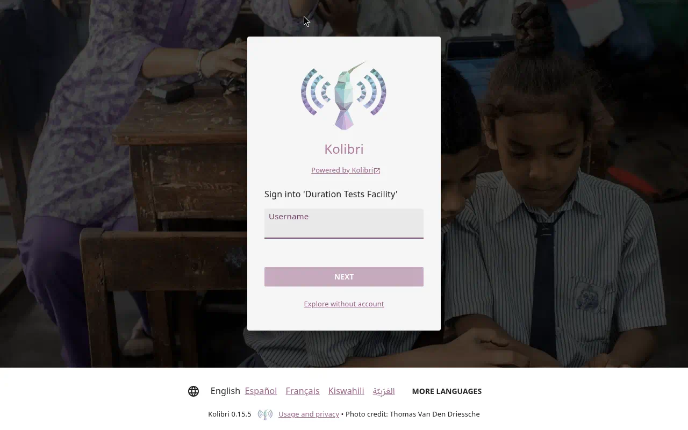
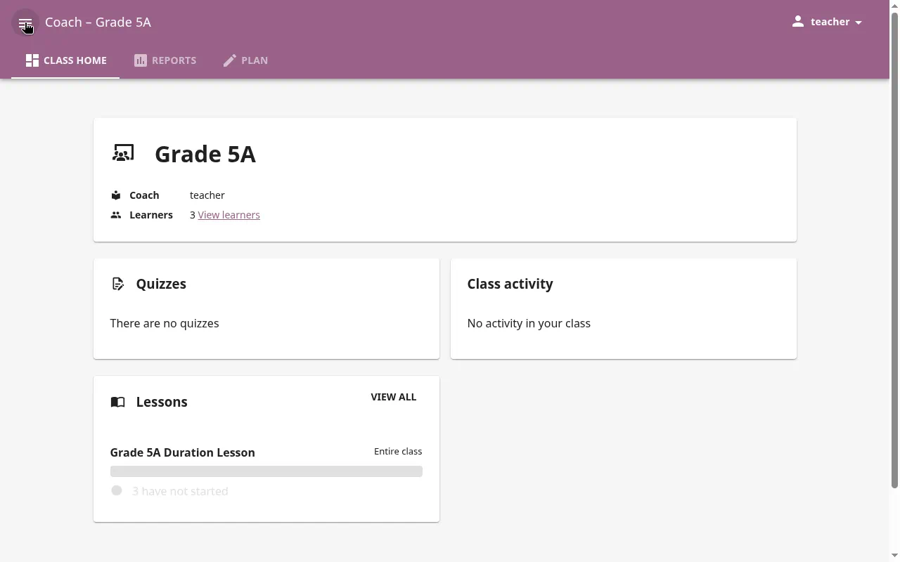
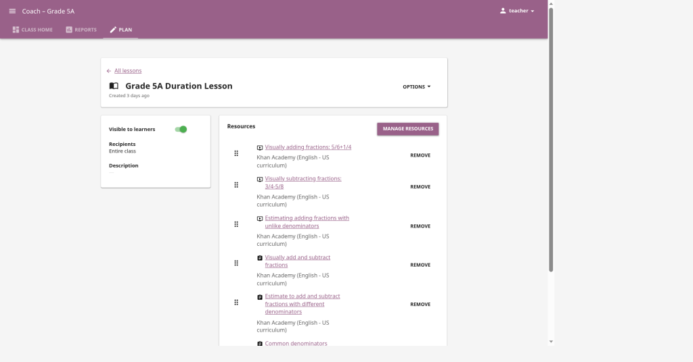
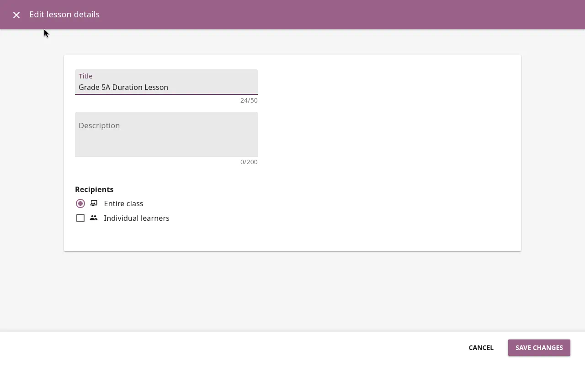
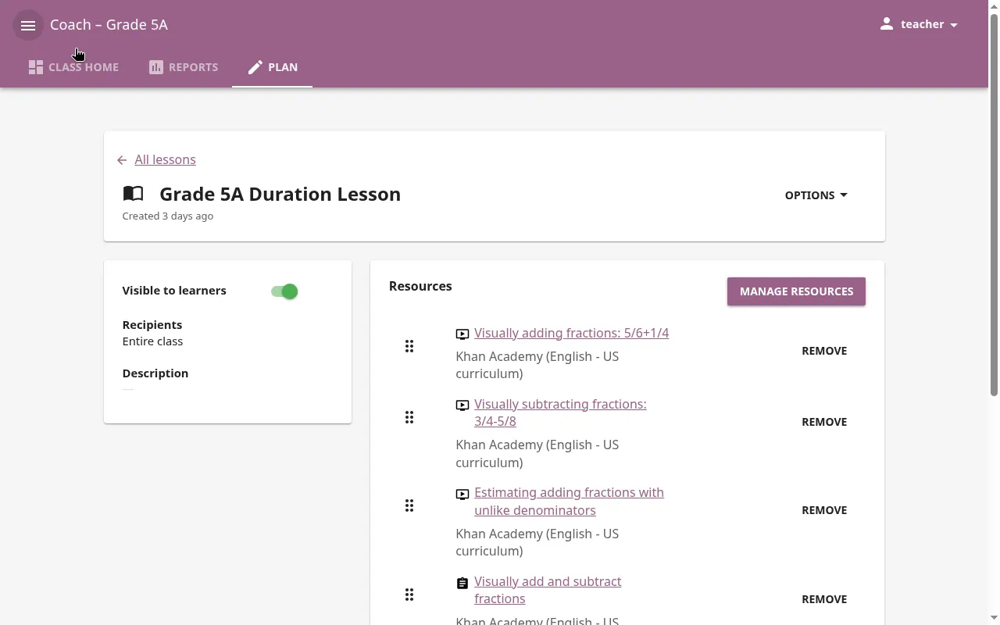
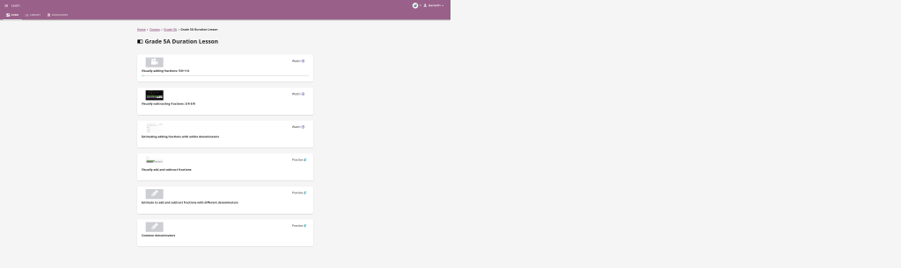
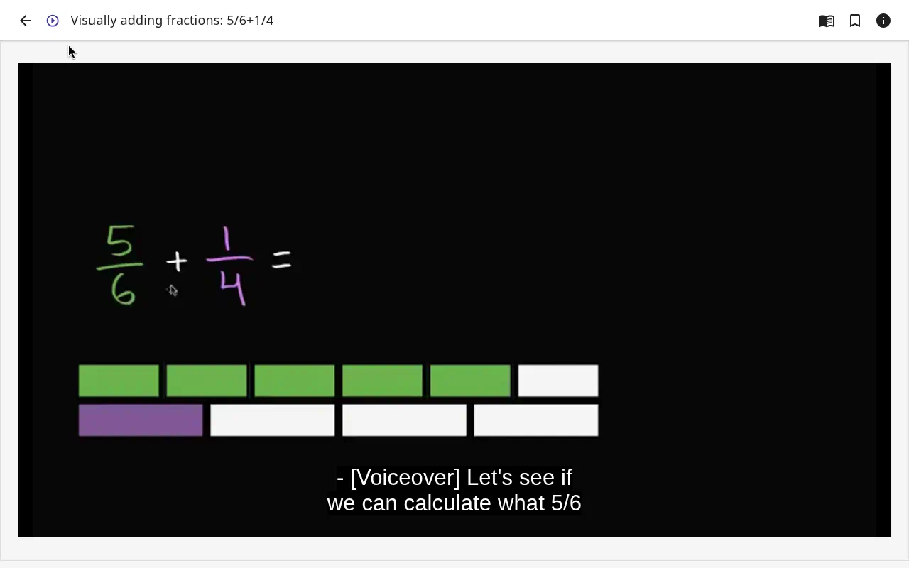
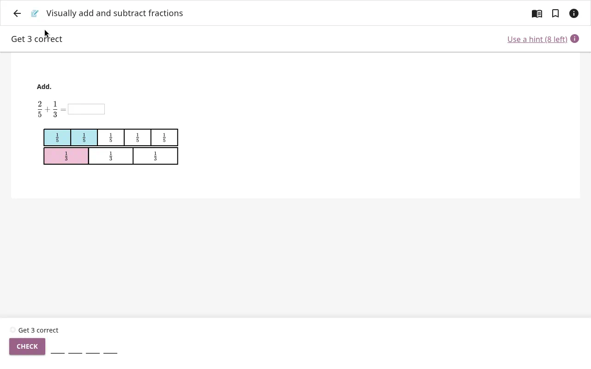
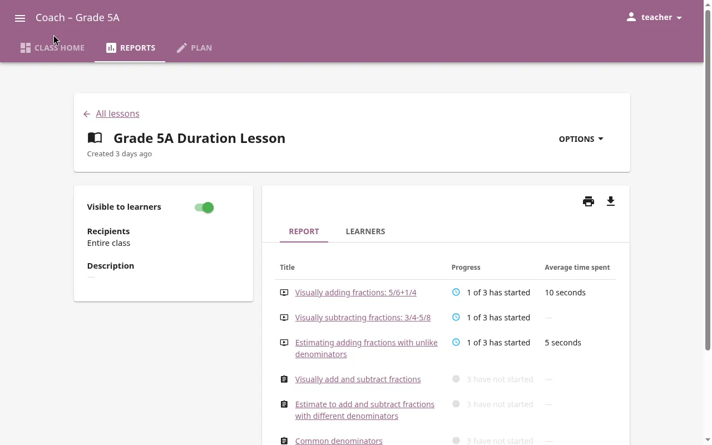
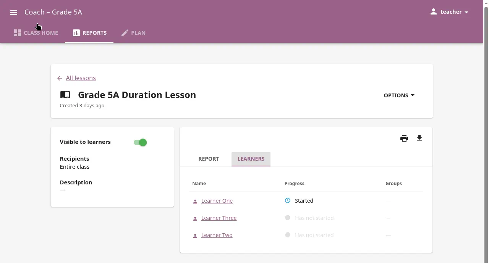

# Grade 5A — Add and subtract fractions

*Console pictures are not in this copy. The lesson screens start at sign-in.*

Monde Primary School.

Lesson name in Kolibri: **Grade 5A Duration Lesson**.

_Tapiwa walks the teacher through this. Read one step. Do it. Then go to the next step._

The lesson is already on the computer. It has three videos, then three exercises. You do not add resources. You do not remove resources. You open it, check it, and make it **Visible** for the class.

---

## Before class

Do this before the learners come in.

### 1. Open Kolibri from the Console

The app is already **Running**. You only open it.

1. Open **Chromium**.
2. Go to the **Console** page this school already uses. Do not type a port number. Do not type a new web address.
3. On the left, the heading says **Network**.

*Picture not in this copy.*

4. You can stay on **All apps**. Or click the disk named **duration-kolibri-grade5a-001**. It sits under the engine name. The right side then shows that disk. The list is headed **Apps**.

*Picture not in this copy.*

5. Find the row named **kolibri-grade5a-001**. The line under that name is the app title. If there is no title, that line says **kolibri-1.0**.
6. Point at the coloured dot on the left of the row. It should say **Running**. The dot is green.
7. **Open** is on the right of that same row. Click **Open**.

*Picture not in this copy.*

A new tab opens. It uses the same computer you already opened the Console on. You do not type a port.

Do not click **Start**. Do not click **Stop**. Do not click **Back up**.

If you do not see **Open**, stop. Call Tapiwa. Do not press **Start** yourself.

### 2. Sign in

1. On the new tab, click **Sign in**.
2. Type your username and password.
3. You should see the Kolibri home page, with **Classes** in the left menu.

### 3. Open the lesson

1. Click **Classes** in the left menu.
2. Click the class for this group. The name on screen is the Grade 5A class.

3. Click **Lessons**.
4. Click **Grade 5A Duration Lesson**.

*Picture not in this copy.*

### 4. Check the resources are in this order

Look at the list inside the lesson. It should be three videos first, then three exercises. Read the names. They should match this list.

**Videos (do these first):**

1. Visually adding fractions: 5/6+1/4
2. Visually subtracting fractions: 3/4-5/8
3. Estimating adding fractions with unlike denominators

**Exercises (do these after the videos):**

4. Visually add and subtract fractions
5. Estimate to add and subtract fractions with different denominators
6. Common denominators

If a name is missing, or the order is wrong, stop. Tell Tapiwa. Do not add or delete resources yourself.

### 5. Check who the lesson is for

1. On the open lesson, find **Recipients**.
2. It must show your Grade 5A class.
3. If the class is not there: click **Edit**, add the class under **Recipients**, and save.

### 6. Make the lesson visible

1. Set the lesson to **Visible**. The button turns blue.
2. Learners can see the lesson the next time they sign in.

If it is already **Visible**, leave it. Do not turn it off.

---

## During class

You lead. The learners work on their own screens. Walk the room. Do not do the exercises for them.

### 1. Learners sign in

Each learner:

1. Opens **Chromium** and the **Console**, the same way you did.
2. Stays on **All apps**, or clicks the disk **duration-kolibri-grade5a-001**.
3. Finds the row **kolibri-grade5a-001**. The dot says **Running**.
4. Clicks **Open**. Does not click **Start**.
5. Clicks **Sign in** and uses their own username and password.

They must sign in with their own name. If they do not sign in, you will not see them in Reports later.

### 2. Learners open the lesson

1. Click **Classes**.
2. Click the Grade 5A class.
3. Click **Lessons**.
4. Click **Grade 5A Duration Lesson**.

They should see the same six resources, videos first.

### 3. Videos first, then exercises

Say this to the class:

1. Do the three videos first. Do not skip them.
2. Watch **Visually adding fractions: 5/6+1/4**.
3. Then watch **Visually subtracting fractions: 3/4-5/8**.
4. Then watch **Estimating adding fractions with unlike denominators**.

5. After the three videos, do the exercises in this order:
   - Visually add and subtract fractions
   - Estimate to add and subtract fractions with different denominators
   - Common denominators
6. Answer the questions on the screen. Kolibri tells them straight away if the answer is right.
7. Stay in this lesson until the six resources are done, or until you say stop.

The video plays in the browser. They do not download it.

If a learner cannot find the lesson, check with them: Did they sign in? Is the lesson **Visible**? Does **Recipients** show this class?

---

## After class — check Reports

Do this when the learners have finished, or at the end of the period.

1. You are signed in as the teacher.
2. Click **Reports** in the left menu.
3. Click **Classes**.
4. Click the Grade 5A class.
5. Click **Lessons**.
6. Click **Grade 5A Duration Lesson**.

You see one row for each learner.

| What you see | What it means |
|--------------|----------------|
| Not started | They have not opened the lesson. Did they sign in? Could they find it? |
| In progress | They started. They have not finished every resource. |
| Completed | They finished the resources in the lesson. |
| Progress | How much of the lesson they opened. |
| Time spent | How long they were on the lesson. |

What to do with it:

- **Not started:** ask the learner. Often they were not signed in, or the lesson was not **Visible**.
- **In progress:** they can finish next time. Note the name.
- You do not need every learner at 100% today. You need to see that they signed in, watched, and tried the exercises.

Tell Tapiwa one thing you saw. Example: "Most of Grade 5A finished the videos. Three learners did not start."

---

## If something is wrong

| What you see | What to do |
|--------------|------------|
| No **Open** on the row **kolibri-grade5a-001** | Stop. Call Tapiwa. Do not press **Start**. |
| Learner cannot sign in | Class → the learner’s name → **Edit** → reset the password. Or call Tapiwa. |
| Lesson not on the learner’s screen | Check **Recipients** shows the class. Turn **Visible** on (button blue). |
| Reports is empty | Learners must sign in with their own name before they start. |
| A resource name is missing | Stop. Tell Tapiwa. Do not add resources yourself. |

---

## Names you click

These are the words on the screen. They are not web addresses.

| Where | The name you click |
|-------|--------------------|
| Disk under the engine name | duration-kolibri-grade5a-001 |
| App row | kolibri-grade5a-001 |
| Lesson | Grade 5A Duration Lesson |
| Class | the Grade 5A class at Monde Primary |
